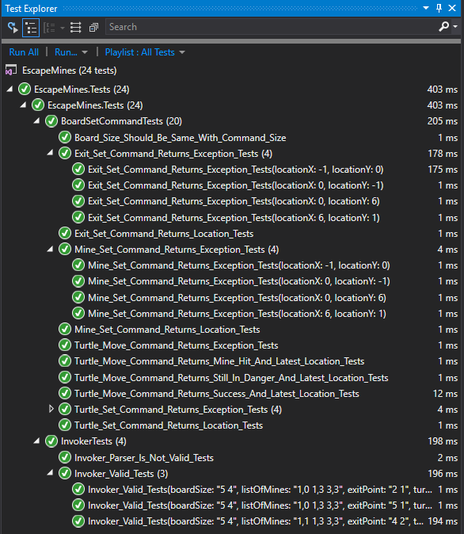
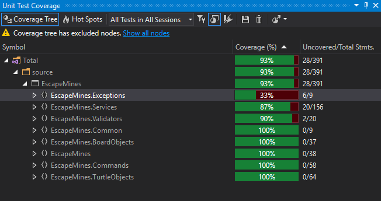

## Escape Mines

### Technical Analysis

Read more [here](./Documents/TechnicalAnalysis.pdf).

### Test Results
Unit Tests                        |  Unit Test Coverage
:-------------------------:|:-------------------------:
 | 

### References

#### Framework and Tools

.NET Core: https://docs.microsoft.com/en-us/dotnet/core/

xUnit (Unit Test): https://xunit.net/

Moq (Fake Objects): https://github.com/moq/moq4

ReSharper for Unit Tests: https://www.jetbrains.com/resharper/features/unit_testing.html

dotCover for Code Coverage: https://www.jetbrains.com/dotcover/features/

#### Patterns and Practices

Command Pattern: https://www.dofactory.com/net/command-design-pattern

Unit Test Best Practices: https://docs.microsoft.com/en-us/dotnet/core/testing/unit-testing-best-practices

